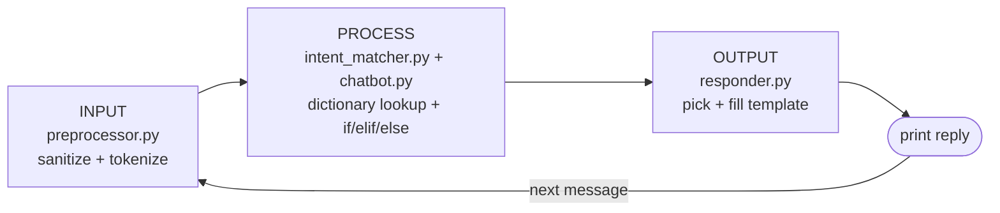

# Rule-Based AI Chatbot


**Nova** is a command-line chatbot that answers predefined inputs using
explicit, deterministic rules. It uses no machine learning and no external
APIs: every reply can be traced back to the rule that produced it.

Built for **DecodeLabs Artificial Intelligence Internship - Project 1:
"The Logic Engine"**.

---

## Contents

- [Requirements coverage](#requirements-coverage)
- [Features](#features)
- [Quick start](#quick-start)
- [Supported inputs](#supported-inputs)
- [How it works](#how-it-works)
- [Design decisions](#design-decisions)
- [Rule-based AI concepts](#rule-based-ai-concepts)
- [Project structure](#project-structure)
- [Running the tests](#running-the-tests)
- [Adding a new intent](#adding-a-new-intent)
- [Limitations and future work](#limitations-and-future-work)

---

## Requirements coverage

Every requirement from the Project 1 brief, where it is implemented, and the
test that checks it ([tests/test_spec_compliance.py](tests/test_spec_compliance.py)).

| Requirement (from the brief) | Implementation |
|---|---|
| Respond to predefined user inputs | 23 intents in [`knowledge_base.py`](chatbot/knowledge_base.py) |
| Handle greetings | `greeting` intent: *hi, hello, hey, good morning, ...* |
| Handle exit commands | `farewell` intent: *bye, exit, quit, goodbye, ...* ends the loop |
| Use if-else logic for responses | if/elif/else decision chain in [`Chatbot.respond()`](chatbot/chatbot.py) |
| Run in a continuous loop | `while True` loop in [`cli.run()`](chatbot/cli.py) |
| **Spec:** Input loop - continuous `while` cycle | `cli.run()` |
| **Spec:** Sanitization - handle case and whitespace | [`preprocessor.sanitize()`](chatbot/preprocessor.py) |
| **Spec:** Knowledge base - dictionary with 5+ intents | `INTENTS` dictionary with 23 intents |
| **Spec:** Fallback - default response for unknowns | `INTENTS.get(intent, FALLBACK)` in [`responder.py`](chatbot/responder.py) |
| **Spec:** Exit strategy - clean break command | Exit command -> goodbye -> `break`; Ctrl+C handled too |

## Features

- **Welcome message** that explains what to try, how to get help and how to leave.
- **23 intents, 260+ phrasings:** greetings, goodbyes, small talk, moods,
  compliments, apologies, jokes, questions about the bot, time, date, and
  more - each with several ways of saying it (*"how are you"*, *"how are u"*,
  *"how's it going"*).
- **Varied replies:** most intents have several replies, and the bot never
  gives the same reply twice in a row when it has another option.
- **Input sanitization:** `"  HELLO!!! "` and `"hello"` are treated the same.
- **Name memory:** say *"my name is Alex"* and later replies use your name.
  Phrases like *"call me later"* are not mistaken for names.
- **Live time and date** from Python's `datetime` module.
- **Helpful fallback:** unknown input gets a short reply; after two misses in a
  row the bot suggests example phrases.
- **Empty input handling:** a blank line and a line of only symbols (`?!`) each
  get their own hint.
- **Clean exit** on `bye`, `exit`, `quit` and 30+ other goodbyes (*"ok bye"*,
  *"good night"*, *"I have to go"*), Ctrl+C or end of input, with no traceback.
  An exit word inside a longer sentence (*"I will not quit"*) gets a hint instead
  of ending the chat.
- **Help command** (`help`) listing everything the bot understands.
- **Trace mode** (`--trace`) shows which rule produced each reply.
- **No dependencies:** Python standard library only.

## Quick start

Requires Python 3.10 or newer.

```bash
git clone https://github.com/SRBaggari/Rule-Based-AI-Chatbot-.git
cd Rule-Based-AI-Chatbot-
python main.py
```

Show the matched rule for every reply:

```bash
python main.py --trace
```

### Example

```text
You: Hello!
Nova: Hello! I'm Nova. How can I help you today?
You: my name is Alex
Nova: Nice to meet you, Alex! I'll remember that.
You: what time is it?
Nova: It's 3:02 PM right now.
You: tell me a joke
Nova: Why was the if-statement so calm? It always had an else to fall back on.
You: bye
Nova: Goodbye, Alex! Thanks for chatting with me.
```

See [docs/sample_conversation.md](docs/sample_conversation.md) for a full
session and trace-mode output.

## Supported inputs

| Intent | Example inputs |
|---|---|
| `greeting` | hi, hello, hey there, good morning, Nova |
| `farewell` (exits) | bye, exit, quit, ok bye, good night, I have to go |
| `exit_hint` | an exit word inside a sentence: "how do I exit?" |
| `help` | help, what can you do, what can I ask |
| `thanks` | thanks, thank you, thank u, cheers |
| `acknowledgement` | ok, cool, got it, yes, no |
| `how_are_you` | how are you, how are u, how's it going, what's up |
| `mood_positive` | I'm good, I am fine, doing great, not bad |
| `mood_negative` | I'm tired, I am sad, not good, bad day |
| `compliment` | you are smart, good bot, well done |
| `criticism` | you are useless, bad bot |
| `apology` | sorry, my bad |
| `laughter` | lol, haha, that was funny |
| `joke` | tell me a joke, another joke, make me laugh |
| `bot_identity` | who are you, what's your name, are you a bot |
| `creator` | who made you, who built you |
| `bot_age` | how old are you, when were you born |
| `how_it_works` | how do you work, what is AI, do you learn |
| `time` | what time is it, what's the time |
| `date` | what's the date, what date is it, today's date |
| `weather` | what's the weather, is it raining (explains it can't check) |
| `name_intro` | my name is Alex, call me Sam |
| `name_recall` | what's my name, who am I |

Matching ignores case and punctuation, and phrases are found anywhere in the
message: *"could you tell me a joke please"* matches `joke`.

## How it works

The bot follows the **Input -> Process -> Output (IPO)** model, with one module
per stage:



1. **Input** - `sanitize()` lowercases the message, trims it, removes
   punctuation and collapses spaces: `"  What's the TIME?? "` -> `"whats the time"`.
2. **Process** - `match_intent()` finds the intent using dictionary lookups,
   in this order:
   - **exact:** the whole message is a command (`"bye"`, `"exit"`)
   - **prefix:** the message starts with a phrase (`"my name is ..."`)
   - **keyword:** a known phrase appears in the message as whole words. Longer
     phrases are tried first, so *"hello, how are you"* is answered as
     `how_are_you`, not `greeting`.

   `Chatbot.respond()` then decides what to do with an if/elif/else chain:

   ```python
   if not clean:                          # empty input (blank or only symbols)
       ...
   elif match is None:                    # no rule matched -> fallback,
       ...                                # with examples after 2 misses in a row
   elif match.intent == "farewell":       # say goodbye, signal exit
       ...
   elif match.intent == "name_intro":     # remember the user's name
       ...
   else:                                  # any other known intent
       ...
   ```
3. **Output** - `build_response()` looks up the intent with
   `INTENTS.get(intent, FALLBACK)`, picks a template and fills in `{name}`,
   `{time}` and `{date}`. If the user's name is known, a nested condition
   switches to personalised replies.

The `while True` loop in `cli.py` repeats this until the farewell branch
signals an exit, then `break`s.

A full decision flowchart is in [docs/flowchart.md](docs/flowchart.md).

## Design decisions

**Dictionary knowledge base, with if-else for control flow.** The brief warns
that a long if-elif ladder is an anti-pattern: it slows down as it grows
(O(n)) and becomes hard to maintain. So the bot's *knowledge* (patterns and
replies) lives in a dictionary and is found with O(1) `.get()` lookups. The
if/elif/else chain only handles *control flow*: empty input, fallback, exit,
name memory, normal reply. It has five branches, and adding intents doesn't
make it any longer.

**Exit only on an exact match.** The message must *be* an exit phrase, so
*"I will not quit"* doesn't end the conversation by accident. To keep leaving
easy, the list of exit phrases covers common goodbyes (*"ok bye"*,
*"bye Nova"*, *"good night"*), and an exit word inside a longer sentence gets
a hint explaining how to leave.

**Patterns are sanitized like user input.** Patterns go through the same
`sanitize()` function when the index is built, so `"What's the time?"` in the
knowledge base and `"whats the time"` typed by a user always compare equal.
The index builder also rejects a pattern that is claimed by two intents.

**Small, explainable state.** The session remembers only the user's name, the
message count, how many misses happened in a row, and the last reply (so it
isn't repeated). There is no database or file storage.

**Logic is separated from I/O.** Only `cli.py` calls `input()` and `print()`.
`Chatbot.respond()` returns a `Reply` object, so every rule can be unit tested
without a terminal.

## Rule-based AI concepts

This project is a small **expert system**: knowledge is written as explicit
rules (*if the input matches X, respond with Y*). That gives it properties
that machine-learning models don't have by default:

| | Rule-based (this project) | Probabilistic (e.g. LLMs) |
|---|---|---|
| Behaviour | Deterministic | Statistical |
| Explainability | White box - every reply is traceable (`--trace`) | Largely a black box |
| Hallucination risk | None - all replies are hard-coded | Possible |
| Flexibility | Only understands what it was given | Handles open-ended input |

Rule-based logic is still used in modern AI, for example as **guardrails**
that filter, redact or block what goes into and out of a language model.

## Project structure

```text
Rule-Based-AI-Chatbot-/
├── main.py                    # Entry point: python main.py [--trace]
├── chatbot/
│   ├── knowledge_base.py      # Intents, patterns, replies (pure data) + lookup indexes
│   ├── preprocessor.py        # INPUT:   sanitize(), tokenize(), ngrams()
│   ├── intent_matcher.py      # PROCESS: match_intent(), extract_name()
│   ├── chatbot.py             # PROCESS: Chatbot.respond() decision logic + Session
│   ├── responder.py           # OUTPUT:  build_response() from templates
│   └── cli.py                 # The while loop: input, output, trace, clean exit
├── tests/                     # 117 unit tests (unittest, standard library)
│   └── test_spec_compliance.py  # one test per Project 1 requirement
└── docs/
    ├── flowchart.md           # IPO and decision flowcharts (Mermaid)
    └── sample_conversation.md # Recorded session
```

## Running the tests

```bash
python -m unittest discover -v
```

The 117 tests cover:

- sanitization edge cases (case, punctuation, blank input, contractions)
- every pattern of every intent resolving to the right intent
- common everyday phrasings (*"how are u"*, *"who made you?"*, *"lol"*)
- whole-word matching (*"this"* doesn't trigger *"hi"*) and longest-phrase priority
- exit phrases, and messages that only *contain* an exit word
- every branch of the if/elif/else decision chain
- fallback escalation, and no reply repeated twice in a row
- name memory, personalised replies, and rejecting non-names (*"call me later"*)
- the loop itself, using scripted input, including Ctrl+C and end of input
- one test per requirement in the Project 1 brief

## Adding a new intent

Edit only [`chatbot/knowledge_base.py`](chatbot/knowledge_base.py):

```python
"favourite_colour": {
    "patterns": ["favourite colour", "favorite color", "what colour do you like"],
    "responses": ["Blue - like the glow of a terminal at night."],
},
```

No changes to the matching or decision logic are needed. The existing tests
check that the new patterns are indexed and that no pattern is claimed by two
intents.

## Limitations and future work

- **Exact matching only.** Typos and synonyms aren't recognised
  (*"helo"* falls back). Semantic matching with vector embeddings is the
  subject of Project 2.
- **Memory lasts one session.** The name is forgotten when the program exits.
- **One intent per message.** *"hi, what time is it?"* answers only the most
  specific phrase.
- **No understanding of negation or context.** Keyword rules see words, not
  meaning: *"I don't want a joke"* still matches `joke`. Only a few negative
  phrases (*"not good"*, *"I'm not okay"*) are handled, by listing them as
  their own patterns.
- **Hybrid architecture.** A natural next step is to keep these rules for known
  questions and pass unmatched input to a language model.

## Author

**srbaggari** - DecodeLabs Artificial Intelligence Internship, Batch 2026.

Thanks to [DecodeLabs](https://www.decodelabs.tech) for the project brief.

## License

[MIT](LICENSE)
