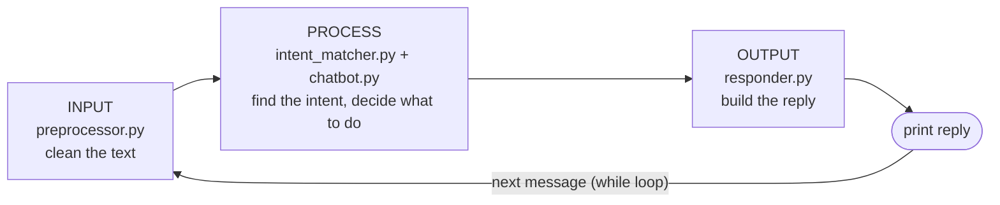

# Nova - Rule-Based AI Chatbot


A command-line chatbot that answers predefined user inputs using explicit,
hand-written rules and if-else decision logic.

**DecodeLabs Artificial Intelligence Internship - Project 1** | Author: **srbaggari**

---

## Table of Contents

1. [Project Overview](#1-project-overview)
2. [Internship Context](#2-internship-context)
3. [Objective](#3-objective)
4. [Features](#4-features)
5. [Technologies Used](#5-technologies-used)
6. [How the Chatbot Works](#6-how-the-chatbot-works)
7. [Rule-Based Decision-Making](#7-rule-based-decision-making)
8. [Project Structure](#8-project-structure)
9. [Installation and Setup](#9-installation-and-setup)
10. [Running the Chatbot](#10-running-the-chatbot)
11. [Example Conversations](#11-example-conversations)
12. [Test Cases](#12-test-cases)
13. [Requirements Satisfied](#13-requirements-satisfied)
14. [Future Improvements](#14-future-improvements)
15. [Conclusion](#15-conclusion)

---

## 1. Project Overview

**Nova** is a text-based chatbot that runs in the terminal. You type a
message, and Nova replies according to a fixed set of rules written in
Python.

Nova is a **rule-based** system:

- It does **not** use machine learning, deep learning, neural networks,
  NLP libraries, generative AI, or any external AI API.
- It does **not** learn from conversations.
- Every reply is written in advance in the project's knowledge base, and you
  can trace each reply back to the exact rule that produced it.

In practice, Nova:

- recognises **23 intents** (topics such as greetings, goodbyes, small talk,
  jokes, time and date), written in **263 phrasings**
- remembers the user's name for the current session
- handles empty and unrecognised input politely
- exits cleanly on commands such as `bye`, `exit` or `quit`

It uses only the Python standard library, so there is nothing to install
beyond Python itself.

## 2. Internship Context

This project is the submission for **Project 1** of the **DecodeLabs
Artificial Intelligence Internship (Industrial Training Kit, Batch 2026)**.
The brief is titled *"The Logic Engine"*.

The brief says Project 1 focuses on **control flow and logic**, not deep
learning. Before building systems that learn, the intern should master
"teaching a machine through explicit if-else instructions". It also covers
these ideas:

- **Rule-based ("white box") systems:** their behaviour is traceable,
  deterministic and free of hallucinations, unlike probabilistic models.
- **The Input -> Process -> Output (IPO) model** as the blueprint for a
  chatbot.
- **A dictionary instead of a long if-elif ladder.** The brief calls the long
  ladder an anti-pattern and recommends `dict.get()` for lookup plus fallback.
- **The "Logic Skeleton" specification:** an input loop, sanitization, a
  dictionary knowledge base with 5+ intents, a fallback, and an exit strategy.

## 3. Objective

> Create a simple rule-based chatbot that responds to predefined user inputs.

The brief's key requirements:

- Handle greetings and exit commands
- Use if-else logic for responses
- Run in a continuous loop

The skills it practises are control flow, decision-making logic and basic AI
concepts.

## 4. Features

**Conversation**

- **Greetings:** *hi, hello, hey there, good morning, hii, sup*, the bot's name
  and more.
- **Predefined topics:**
  - small talk and moods
  - questions about the bot (who it is, who made it, how it works, its age)
  - jokes, help, thanks, apologies, compliments
  - current time and date
- **Several ways to say each thing.** For example, *"how are you"*,
  *"how are u"*, *"how's it going"* and *"what's up"* all lead to the same intent.
- **Varied replies.** Most intents have several replies, and Nova doesn't give
  the same reply twice in a row when it has another one available.
- **Name memory.** Say *"my name is Alex"* and later replies use your name
  (*"Hi Alex! Good to see you."*). Phrases like *"call me later"* are not
  mistaken for names.

**Input handling**

- **Case-insensitive.** *"  HELLO!!! "* and *"hello"* are treated the same.
  Punctuation and extra spaces are ignored too.
- **Empty input.** A blank line gets *"You didn't type anything..."*. A line of
  only symbols, such as *"?!"*, gets *"I can only read words..."*.
- **Unknown input.** You get a polite fallback reply. After two unrecognised
  messages in a row, Nova suggests example phrases.

**Exiting**

- **Exit commands:** `bye`, `exit`, `quit`, plus 30+ common goodbyes such as
  *"ok bye"*, *"good night"* and *"I have to go"*.
- **No accidental exits.** A message that only *contains* an exit word, such
  as *"I will not quit"*, doesn't end the chat; Nova explains how to leave
  instead.
- **Clean shutdown** on Ctrl+C or end of input, with no error traceback.

**Usability**

- A **welcome message** with example phrases, and a **`help`** command that
  lists what Nova understands.
- **Trace mode** (`--trace`) prints which rule produced each reply.

## 5. Technologies Used

| Technology | Used for |
|---|---|
| **Python 3.10+** | The whole project. Tested on Python 3.10, 3.12 and 3.14. |
| `re` | Removing punctuation while cleaning input |
| `random` | Choosing among several possible replies |
| `datetime` | Current time and date replies |
| `dataclasses` | Small data containers (`Session`, `Reply`, `Match`) |
| `argparse` | The `--trace` command-line option |
| `unittest`, `doctest` | Automated tests |
| `ast`, `inspect` | Tests that check the source code really uses `while True` and if/elif/else |
| Git and GitHub | Version control and hosting |
| Mermaid | Flowcharts in the documentation (rendered by GitHub) |

All of these are part of Python's standard library or are developer tools. The
project has **no third-party dependencies**, so there is no
`requirements.txt`. The [ruff](https://docs.astral.sh/ruff/) linter was used
during development to check code style, but you don't need it to run the bot.

## 6. How the Chatbot Works

Nova follows the **Input -> Process -> Output** model from the brief. Each
stage has its own module:



What happens to one message:

1. **Read.** `cli.run()` runs a `while True` loop and reads a line with
   `input("You: ")`.
2. **Clean (Input).** `sanitize()` lowercases the text, trims it, removes
   punctuation and collapses spaces:
   `"  What's the TIME?? "` becomes `"whats the time"`.
3. **Match (Process).** `match_intent()` looks the cleaned text up in
   dictionaries built from the knowledge base. It tries three kinds of rule, in
   order:

   | Rule | Meaning | Example |
   |---|---|---|
   | **exact** | The whole message is a command | `"bye"`, `"exit"`, `"good night"` |
   | **prefix** | The message starts with a phrase | `"my name is ..."`, `"call me ..."` |
   | **keyword** | A known phrase appears in the message as whole words; longer phrases are tried first | `"could you tell me a joke please"` matches `"tell me a joke"` |

4. **Decide (Process).** `Chatbot.respond()` uses an if/elif/else chain to
   choose what to do (see [section 7](#7-rule-based-decision-making)).
5. **Reply (Output).** `build_response()` picks one of the intent's reply
   templates and fills in the placeholders `{name}`, `{time}` and `{date}`.
6. **Repeat or stop.** The loop prints the reply and waits for the next
   message. If the user said goodbye, it runs `break` and the program ends.

The full decision flowchart is in [docs/flowchart.md](docs/flowchart.md).

## 7. Rule-Based Decision-Making

### What "rule-based" means here

A rule-based system works through explicit **if-then rules** written by a
person: *if the input matches X, respond with Y*. There is no training data
and no statistical model. This is the classic, *symbolic* approach to AI, the
same family as early chatbots such as ELIZA and as expert systems.

| | Rule-based (this project) | Machine-learning models (e.g. LLMs) |
|---|---|---|
| How it decides | Hand-written rules | Patterns learned from data |
| Behaviour | Deterministic: the same input always matches the same rule | Probabilistic |
| Explainability | White box: `--trace` shows the rule behind every reply | Largely a black box |
| Made-up answers | Impossible: every reply is pre-written | Possible ("hallucination") |
| Flexibility | Only understands what it was given | Handles open-ended input |

### Where the rules live: a dictionary knowledge base

All of Nova's knowledge is plain data in the `INTENTS` dictionary in
[`chatbot/knowledge_base.py`](chatbot/knowledge_base.py):

```python
"greeting": {
    "patterns": ["hi", "hello", "hey", "good morning", ...],
    "responses": ["Hello! I'm {bot}. How can I help you today?", ...],
    "personal_responses": ["Hi {name}! Good to see you.", ...],
},
```

Patterns are looked up with dictionary `.get()` calls, not a long chain of
`if text == ...` checks. The brief recommends this because a long if-elif
ladder gets slower and harder to maintain with every rule you add. Finding the
reply and falling back to a default happen in one step, exactly as the brief
shows:

```python
entry = INTENTS.get(intent, FALLBACK)
```

### Where the if-else logic lives: the decision chain

Once the intent is known, a short **if/elif/else** chain in
[`Chatbot.respond()`](chatbot/chatbot.py) decides what the bot should *do*:

```python
if not clean:                        # 1. empty input
    # nested if: blank line vs. symbols only ("?!")
elif match is None:                  # 2. no rule matched
    # nested if: 2+ misses in a row -> suggest example phrases
elif match.intent == "farewell":     # 3. exit command
    # say goodbye and tell the loop to stop
elif match.intent == "name_intro":   # 4. "my name is ..."
    # nested if: store the name only if it is a valid name
else:                                # 5. any other known intent
    # look up the reply (personalised if the name is known)
```

The chain has five branches, plus a few nested conditions. Adding new intents
to the dictionary doesn't make it any longer.

### The continuous loop

The conversation loop in [`chatbot/cli.py`](chatbot/cli.py) has the same
shape as the brief's "heartbeat" example (simplified here; the real code also
prints trace lines):

```python
while True:
    try:
        user_input = input_fn("You: ")
    except (KeyboardInterrupt, EOFError):   # Ctrl+C or end of input
        ...say goodbye...
        break
    reply = bot.respond(user_input)
    output_fn(f"Nova: {reply.text}")
    if reply.should_exit:                   # the user said bye / exit / quit
        break
```

### Design choices worth noting

- **Exit only on an exact match.** The whole message must be an exit phrase,
  so *"I will not quit"* can't end the chat by accident. An exit word inside a
  sentence gets a hint instead.
- **Longest phrase wins.** In *"hello, how are you"*, the three-word phrase
  `how are you` beats the one-word `hello`, so the reply answers the question.
  Likewise, *"I'm great"* matches the mood phrase `im great` rather than the
  one-word acknowledgement `great`.
- **Patterns are cleaned the same way as input.** Each pattern goes through
  `sanitize()` when the lookup dictionaries are built, so the two always
  compare in the same form. The builder also raises an error if two intents
  claim the same phrase for the same kind of rule.
- **Logic is separate from input/output.** Only `cli.py` calls `input()` and
  `print()`. `Chatbot.respond()` just returns a `Reply` object, which makes
  every rule easy to unit test.

## 8. Project Structure

```text
Rule-Based-AI-Chatbot-/
├── main.py                      # Entry point: python main.py [--trace]
├── chatbot/
│   ├── __init__.py              # Package description and version
│   ├── knowledge_base.py        # Data: 23 intents, patterns, replies + lookup dictionaries
│   ├── preprocessor.py          # INPUT:   sanitize(), tokenize(), ngrams()
│   ├── intent_matcher.py        # PROCESS: match_intent(), extract_name()
│   ├── chatbot.py               # PROCESS: Chatbot.respond() if/elif/else logic + Session
│   ├── responder.py             # OUTPUT:  build_response(), render() from templates
│   └── cli.py                   # The while loop, welcome message, trace mode, clean exit
├── tests/
│   ├── test_preprocessor.py     # Input cleaning
│   ├── test_knowledge_base.py   # Knowledge base structure and lookup dictionaries
│   ├── test_intent_matcher.py   # Matching rules, exit phrases, name extraction
│   ├── test_responder.py        # Reply templates, placeholders, no-repeat
│   ├── test_chatbot.py          # Every decision branch, session memory
│   ├── test_cli.py              # The loop with scripted input, Ctrl+C, trace mode
│   └── test_spec_compliance.py  # One test per Project 1 requirement
├── docs/
│   ├── flowchart.md             # IPO and decision flowcharts (Mermaid)
│   └── sample_conversation.md   # A full recorded session
├── README.md
├── LICENSE                      # MIT
├── .gitignore
└── .gitattributes
```

## 9. Installation and Setup

**Prerequisite:** Python 3.10 or newer. Python 3.9 and older won't work,
because the code uses the `X | None` type syntax added in 3.10.

Check your version:

```bash
python --version
```

Clone the repository:

```bash
git clone https://github.com/SRBaggari/Rule-Based-AI-Chatbot-.git
cd Rule-Based-AI-Chatbot-
```

That's all. There are no packages to install and no virtual environment is
needed. (You can still use one if you like.)

## 10. Running the Chatbot

Start a conversation:

```bash
python main.py
```

Start with **trace mode**, which shows the rule behind each reply:

```bash
python main.py --trace
```

Show the command-line help:

```bash
python main.py --help
```

**While chatting:**

- Type `help` to see what Nova understands.
- Type `bye`, `exit` or `quit` to leave. You can also press **Ctrl+C**.

Run the automated tests:

```bash
python -m unittest discover -v
```

## 11. Example Conversations

These are recorded from real runs. Nova picks randomly between several
replies, so the exact wording, time and date will differ when you run it.

### Greetings, questions and name memory

```text
You: Hello!
Nova: Hey! I'm Nova, your rule-based assistant. What's on your mind?
You: how are u?
Nova: Doing great, thanks for asking! How are you?
You: I'm good
Nova: Glad to hear it! What would you like to talk about?
You: who made you?
Nova: I was built by srbaggari as Project 1 of the DecodeLabs Artificial Intelligence Internship.
You: my name is Alex
Nova: Nice to meet you, Alex! I'll remember that.
You: what time is it?
Nova: The current time is 3:16 PM.
You: what's the date today
Nova: Today is Friday, 2 October 2026.
You: tell me a joke
Nova: Why do programmers prefer dark mode? Because light attracts bugs.
You: lol
Nova: Glad that made you smile!
You: what's my name
Nova: You told me your name is Alex.
```

### Empty and unknown input

```text
You:
Nova: You didn't type anything. Say 'hi', or type 'help' to get started.
You: asdf
Nova: Hmm, that's not in my rulebook. Try 'help' for ideas.
You: what is the capital of France
Nova: I'm still not following, sorry. I only understand predefined phrases.
  Try one of these: 'hello', 'how are you?', 'what time is it?', 'tell me a joke', or 'help' for the full list.
```

### Exiting

```text
You: thanks
Nova: You're welcome, Alex!
You: ok bye
Nova: Goodbye, Alex! Thanks for chatting with me.

(Session ended after 15 messages.)
```

### Trace mode

```text
You: Hi there
  [trace] input='hi there' -> rule=keyword matched='hi there' -> intent=greeting
Nova: Hey! I'm Nova, your rule-based assistant. What's on your mind?
You: I will not quit
  [trace] input='i will not quit' -> rule=keyword matched='quit' -> intent=exit_hint
Nova: If you'd like to leave, just type 'bye' on its own.
You: call me later
  [trace] input='call me later' -> rule=prefix matched='call me' -> intent=name_intro
Nova: I didn't quite catch your name. Try 'my name is Alex'.
You: exit
  [trace] input='exit' -> rule=exact matched='exit' -> intent=farewell
Nova: See you later! Have a great day.
```

The full session, including the welcome message and the `help` output, is in
[docs/sample_conversation.md](docs/sample_conversation.md).

## 12. Test Cases

### Automated tests

The project has **117 automated tests** (`unittest` plus `doctest`). They
pass on Python 3.10, 3.12 and 3.14. Run them with:

```bash
python -m unittest discover -v
```

| Test file | What it checks |
|---|---|
| `test_preprocessor.py` | Case, whitespace and punctuation cleaning; blank input; contractions |
| `test_knowledge_base.py` | Every intent has patterns and replies; placeholders are valid; no phrase is claimed by two intents |
| `test_intent_matcher.py` | Every pattern reaches its own intent; whole-word matching; longest phrase wins; exit phrases; name extraction |
| `test_responder.py` | Replies come from the right templates; time, date and name are filled in; no immediate repeats |
| `test_chatbot.py` | Every branch of the if/elif/else chain; name memory; fallback escalation; only goodbyes end the chat |
| `test_cli.py` | The loop runs until an exit command; lines after an exit are never read; Ctrl+C and end of input exit cleanly; trace mode |
| `test_spec_compliance.py` | One test per requirement in the Project 1 brief (see [section 13](#13-requirements-satisfied)) |

### Main conversation test cases

Each case below has been run against the chatbot, and each one passed.

| ID | Scenario | Input | Expected result |
|---|---|---|---|
| TC01 | Greeting | `hello` | Greeting reply |
| TC02 | Case-insensitive input | `  HELLO!!! ` | Same greeting reply as `hello` |
| TC03 | Multiple greetings | `good morning`, `hey there`, `hii` | Greeting reply for each |
| TC04 | Predefined question | `how are you?` | "How are you" reply |
| TC05 | Question about the bot | `who made you?` | Creator reply |
| TC06 | Dynamic reply | `what time is it?` | The current time |
| TC07 | Dynamic reply | `what's the date?` | Today's date |
| TC08 | Joke | `tell me a joke` | One of 7 jokes |
| TC09 | Name memory | `my name is Alex`, then `what's my name?` | "Your name is Alex." |
| TC10 | Invalid name | `call me later` | Asks for the name again; nothing stored |
| TC11 | Longest phrase wins | `hello, how are you` | Answers *how are you*, not the greeting |
| TC12 | Unknown input | `asdf` | Polite fallback reply |
| TC13 | Repeated unknown input | `asdf`, then `qwerty` | Fallback with example phrases |
| TC14 | Empty input | *(blank line)* | "You didn't type anything..." |
| TC15 | Symbols only | `?!` | "I can only read words, not symbols..." |
| TC16 | Exit commands | `bye`, `EXIT`, `quit` | Goodbye reply; the loop ends |
| TC17 | Natural goodbye | `ok bye` | Goodbye reply; the loop ends |
| TC18 | Exit word inside a sentence | `I will not quit` | Hint on how to leave; the chat continues |
| TC19 | Ctrl+C / end of input | *(interrupt)* | Goodbye reply; no traceback |
| TC20 | Help | `help` | List of supported topics |

TC19 was checked in two ways: end of input was tested by piping input into
`main.py`, and Ctrl+C by a unit test that simulates the interrupt.

## 13. Requirements Satisfied

Every requirement from the Project 1 brief is implemented and has its own test
in [tests/test_spec_compliance.py](tests/test_spec_compliance.py).

**Key requirements**

| Requirement | How it is satisfied | Where |
|---|---|---|
| Respond to predefined user inputs | 23 intents and 263 phrasings in the knowledge base | [`knowledge_base.py`](chatbot/knowledge_base.py) |
| Handle greetings | `greeting` intent with 19 greeting phrases | [`knowledge_base.py`](chatbot/knowledge_base.py) |
| Handle exit commands | `bye`, `exit`, `quit` and other goodbyes end the loop | [`chatbot.py`](chatbot/chatbot.py), [`cli.py`](chatbot/cli.py) |
| Use if-else logic for responses | if/elif/else decision chain with nested conditions | [`Chatbot.respond()`](chatbot/chatbot.py) |
| Run in a continuous loop | `while True` loop that runs until an exit | [`cli.run()`](chatbot/cli.py) |

**Logic Skeleton specification**

| Spec item | How it is satisfied | Where |
|---|---|---|
| Input loop: continuous `while` cycle | `while True:` reading `input("You: ")` | [`cli.run()`](chatbot/cli.py) |
| Sanitization: handle case and whitespace | Lowercase, strip, collapse spaces, remove punctuation | [`sanitize()`](chatbot/preprocessor.py) |
| Knowledge base: dictionary with 5+ intents | `INTENTS` dictionary with 23 intents | [`knowledge_base.py`](chatbot/knowledge_base.py) |
| Fallback: default response for unknowns | `INTENTS.get(intent, FALLBACK)`, with example phrases after repeated misses | [`responder.py`](chatbot/responder.py), [`chatbot.py`](chatbot/chatbot.py) |
| Exit strategy: clean break command | Goodbye reply followed by `break`; Ctrl+C and end of input handled | [`cli.run()`](chatbot/cli.py) |

**Key skills from the brief**

- **Control flow:** a `while True` loop, `break`, and `try`/`except` for
  interrupts.
- **Decision-making logic:** the if/elif/else chain and nested conditions, plus
  rule priority (exact, then prefix, then keyword; longest phrase first).
- **Basic AI concepts:**
  - intents and pattern matching
  - a knowledge base
  - the Input -> Process -> Output model
  - deterministic, traceable "white box" behaviour

## 14. Future Improvements

These are **not implemented**. They are possible next steps.

- **Typo tolerance:** spelling variants like *"helo"* currently fall back.
  Simple fuzzy matching (for example, Python's `difflib`) could help.
- **Meaning-based matching:** Nova matches words, not meaning, so
  *"I don't want a joke"* still matches the joke rule. The internship's
  Project 2 covers matching by meaning using vector embeddings.
- **Several intents in one message:** *"hi, what time is it?"* answers only the
  most specific phrase (the time).
- **Memory between sessions:** the user's name is forgotten when the program
  exits. It could be saved to a small file.
- **Loading rules from a file:** moving `INTENTS` to a JSON file would let
  non-programmers edit the bot's knowledge.
- **A graphical or web interface:** because the logic is separate from
  `cli.py`, a GUI could reuse `Chatbot.respond()` without changes.
- **Hybrid design:** keep these rules for known questions and pass unmatched
  input to a language model. The brief describes this *hybrid architecture* as
  how rule-based logic is used alongside modern AI.

## 15. Conclusion

Nova meets every requirement of DecodeLabs Project 1:

- It responds to predefined inputs.
- It handles greetings and exit commands.
- It makes decisions with if-else logic.
- It runs in a continuous loop.
- It covers every item in the brief's Logic Skeleton specification.

Beyond the minimum, Nova adds:

- a dictionary knowledge base, as the brief recommends
- a clean Input -> Process -> Output structure
- session memory for the user's name
- careful handling of empty, unknown and ambiguous input
- trace mode, so every answer can be explained
- 117 automated tests

The project shows the main strength of rule-based AI: Nova only says what it
was explicitly told to say, and every answer can be traced to its rule. It
also shows the limits, such as no typo tolerance and no understanding of
meaning. Those limits are what later projects in the internship address.

---

## License

Released under the [MIT License](LICENSE).

## Acknowledgements

Thanks to [DecodeLabs](https://www.decodelabs.tech) for the internship
programme and the Project 1 brief.
