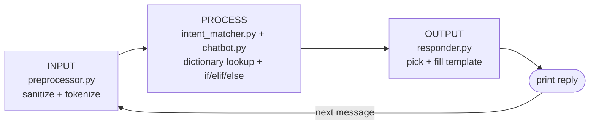
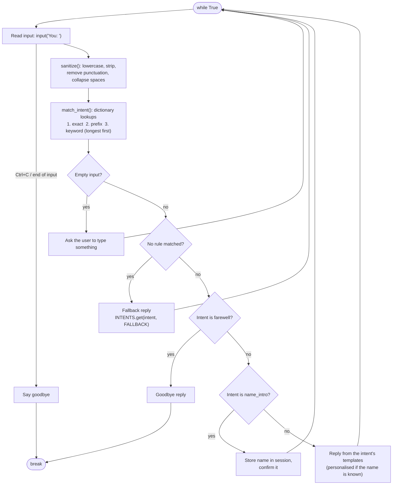

# Control Flow

## Input -> Process -> Output

```mermaid
flowchart LR
    A["INPUT<br/>preprocessor.py<br/>sanitize + tokenize"] --> B["PROCESS<br/>intent_matcher.py + chatbot.py<br/>dictionary lookup + if/elif/else"]
    B --> C["OUTPUT<br/>responder.py<br/>pick + fill template"]
    C --> D(["print reply"])
    D -->|"next message"| A
```

## One turn of the conversation loop

```mermaid
flowchart TD
    start(["while True"]) --> read["Read input: input('You: ')"]
    read -->|"Ctrl+C / end of input"| bye_signal["Say goodbye"]
    read --> clean["sanitize(): lowercase, strip,<br/>remove punctuation, collapse spaces"]
    clean --> match["match_intent(): dictionary lookups<br/>1. exact  2. prefix  3. keyword (longest first)"]
    match --> empty{"Empty input?"}
    empty -->|yes| r_empty["Ask the user to type something"]
    empty -->|no| unknown{"No rule matched?"}
    unknown -->|yes| r_fallback["Fallback reply<br/>INTENTS.get(intent, FALLBACK)"]
    unknown -->|no| farewell{"Intent is farewell?"}
    farewell -->|yes| r_bye["Goodbye reply"] --> stop(["break"])
    farewell -->|no| name{"Intent is name_intro?"}
    name -->|yes| r_name["Store name in session,<br/>confirm it"]
    name -->|no| r_intent["Reply from the intent's templates<br/>(personalised if the name is known)"]
    r_empty --> start
    r_fallback --> start
    r_name --> start
    r_intent --> start
    bye_signal --> stop
```
